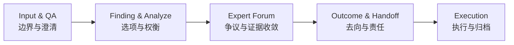
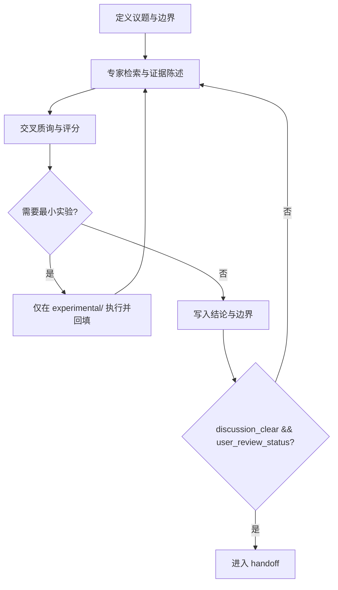
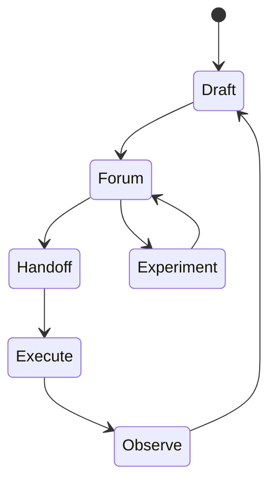

# Brainstorm 的自解释系统与专家论坛评审系统

> Coding 的尽头是项目管理

这篇文章讨论的不是“怎么把文字写得漂亮”，而是一个更实际的问题：一段讨论交给下一位同事后，信息还能不能保持完整。很多团队并不缺想法，也不缺执行力，真正反复消耗时间的，往往是交接时的信息失真。我们想解决的，就是这个失真过程。

## 一、问题通常不是出在讨论现场，而是出在交接接口

一个常见场景是：会上说“先把结构讲清楚，再润色表达”，会后却有人先改措辞，有人先改框架。两边都不是故意跑偏，但下次同步时就会发现彼此改的不是同一件事。返工在这个时刻开始，而且很难追责，因为每个人都能给出看似合理的解释。

这种偏差通常沿着同一条路径扩散。先是结构名称变化过快，导致前一轮产物无法直接复用；然后是结论先写、证据后补，导致后续评审无法判断结论强度；最后是“讨论结束”被误认为“任务完成”，但实际交接对象、交接内容和验收条件没有写清。问题并不神秘，本质上是接口缺位。

## 二、把讨论写成可执行记录，需要明确分工而不是增加文档数量

四个文件的意义，不在于“流程完整”，而在于“责任可追踪”。`input_and_qa.md` 负责锁定边界，避免问题定义在中途变化；`finding_and_analyze.md` 负责保存备选方案和权衡理由，避免决策在传递中被简化成一句口号；`expert_forum.md` 负责集中争议和证据，避免关键判断散落在聊天记录里；`outcome_and_handoff.md` 负责写清去向和责任，避免工作停在“结论很好，但没人接手”。

这四个接口的写法也需要统一顺序。章节开头可以先说本节判断，帮助读者定位；段落内部先给证据和机制，再形成局部结论；最后把结论落成动作与验收信号。这样做的好处是，文章既能快速阅读，也能经得起复盘。

这张图表达的不是“谁先谁后的仪式感”，而是依赖关系。只有上游信息完整，下游判断才稳定。

## 三、专家论坛的作用是收敛争议，不是增加会议时长

论坛最容易失效的方式，是把“发言充分”当成“结论可靠”。真正有效的论坛通常遵循同一节奏：先证据陈述，再交叉质询，再形成评分和结论。如果顺序反过来，团队很容易在结论上先站队，后续证据只能变成补充材料。

门禁也不需要复杂。关键观点必须映射到参考资料、实验结果或状态字段；评分必须给出分值和理由，且评价对象是论证质量而不是个人；用户评判结果必须回填到文档，而不是停留在口头确认。满足这三条，论坛输出才有可执行性。

反例很好判断：如果会议结束时大家都“觉得方向没问题”，但没人能说出验收条件和回退条件，这次会议大概率还不能进入 handoff。表面共识并不等于可交付结论。

图中的回路是关键。没有门禁通过，就不往下游推进。

## 四、同一份主稿可以同时服务发布与执行，只要投影方式清晰

对外发布稿和对内执行稿并不冲突。前者强调问题场景和可读性，后者强调门禁、路径和责任。最稳妥的做法不是维护两份长期分叉文档，而是维护一份主稿，再根据读者场景做两种投影。

| 维度 | 对外发布版 | 对内执行版 |
|------|------------|------------|
| 开篇任务 | 解释问题为何值得关心 | 声明边界、角色与目标 |
| 主要证据 | 场景案例与关键信号 | 规则字段与验收条件 |
| 结尾形式 | 读者下一步动作 | 团队回填与交接路径 |

上线后可以先观察三个信号：核心判断是否能被快速复述，关键结论是否能追踪到证据，handoff 是否能一次通过。如果两周后仍频繁出现整篇重写，通常说明系统还停留在表达层，没有进入接口层。

这个循环图对应的是持续改进机制：写作不是一次性产物，而是反复验证的过程。

## 结语

技术写作真正难的部分，不是句子本身，而是交接质量。  
当任务跨会话、跨角色推进时，谁能把判断写成可验证、可回溯、可执行的记录，谁就能稳定降低协作成本。
