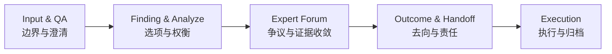
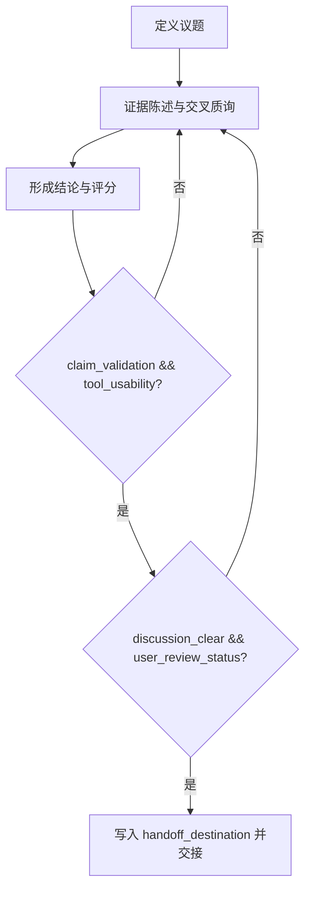
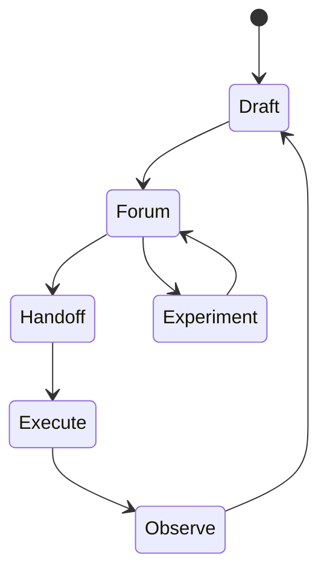

# Brainstorm 的自解释系统与专家评审系统

这篇文章写给需要把想法整理成计划，并把计划稳定交接给下一位执行者的人。我们关心的不是“会议上聊得是否热闹”，而是三天后、两周后，这份结论还能不能被准确复用。

## 一、真正的问题发生在交接，而不是讨论当下

### 1) 讨论当下看起来一致，交接后却开始分叉

项目里最常见的偏差是：会上同意先整理结构，落地时却有人先改措辞，有人先改流程。每个人都觉得自己在推进，但下一轮同步会发现，大家修改的对象已经不是同一件事。

### 2) 交接失真的三个信号

如果你想快速判断这类偏差是否已经发生，可以先看三个信号：阶段命名是否频繁变化、关键结论是否能找到证据、讨论结束后是否有明确 handoff 去向。前两个信号影响复盘质量，最后一个信号决定执行是否真正开始。

### 3) 为什么这不是“写作风格”问题

这类失真通常不是文风差异造成的，而是接口缺位。只要“谁接、接什么、按什么验收”没有写进文档，组织就只能靠口头记忆协作，而口头记忆的半衰期往往比项目节奏更短。

## 二、把讨论变成计划，需要稳定的文档接口

### 1) 四份文档分别兜住四类风险

`input_and_qa.md` 用来锁定边界，避免问题定义中途漂移；`finding_and_analyze.md` 保存备选方案和权衡依据，避免决策理由丢失；`expert_forum.md` 集中争议与证据，避免关键判断散落在聊天记录；`outcome_and_handoff.md` 声明去向与责任，避免“结论很好但无人承接”。

### 2) 论证顺序如何既好读又可复核

章节层面先给判断，帮助读者快速定位；段落层面先给证据和机制，再形成局部结论；结尾再落到动作与验收。这样既能保证扫描效率，也能避免“只有观点没有证据”的空结论。

### 3) 架构图：四份文档如何协同

这张图的作用不是展示流程美观，而是说明依赖关系：上游记录不完整，下游执行就会不稳定。

## 三、专家论坛要输出“可执行结论”，必须保留字段级门禁

### 1) 仅有叙述，不足以支撑执行

可读性可以通过叙述提升，但可执行性必须靠字段约束兜底。把硬约束完全写成散文，会让执行入口变得模糊，团队需要再次翻译文本才能落地。

### 2) 最低门禁字段（建议保留在执行稿）

| 字段 | 最低要求 | 不满足时处理 |
|------|----------|--------------|
| `discussion_clear` | `true` 才能进入 handoff | 返回论坛继续收敛 |
| `user_review_status` | 仅允许 `approved` / `changes_requested` | 保持待办，不得归档 |
| `claim_validation` | 明确 `pass/fail` 与证据 | 标记为观点未验证 |
| `tool_usability` | 明确 `pass/fail` 与复现路径 | 标记为工具不可用 |
| `handoff_destination` | 必须可定位到文件或系统路径 | 视为未完成交接 |

可以把这些字段放在执行稿中集中呈现，对外发布稿则可折叠展示，但不建议删除。

### 3) 流程图：门禁如何阻止伪完成

图里最重要的是回退条件。没有回退条件，流程只是在前进，不是在收敛。

## 四、对外发布稿和对内执行稿可以同源，但不能混写

### 1) 发布稿应删掉什么

发布稿应删除版本演进元数据，例如 `based_on`、`thinking_model_used`、`techniques_added` 这类内部迭代字段。它们对读者价值有限，却会削弱成文感和专业感。

### 2) 执行稿应补上什么

执行稿应保留字段级门禁、评分依据、实验路径和交接去向。简化表达可以做，但这些结构化信号不能丢，否则团队会回到“讨论清楚了，但执行入口不清楚”的状态。

### 3) 上线后如何判断系统是否有效

建议持续观察三个指标：核心结论能否在 30 秒内复述、关键判断是否能追踪到证据、handoff 是否能一次通过。指标不高时，先查接口字段是否缺失，再查行文表达。

### 4) 循环图：从一次写作到持续改进

这张图对应的是一个朴素事实：可用的写作体系不是一次性产物，而是可复盘、可迭代的工作循环。

## 结语

写作质量的上限，最终由交接质量决定。  
当任务跨会话、跨角色推进时，谁能把判断写成可验证、可回溯、可执行的记录，谁就能稳定降低协作成本。
