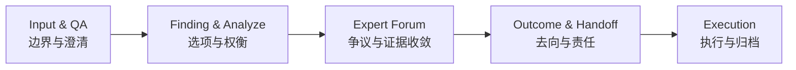
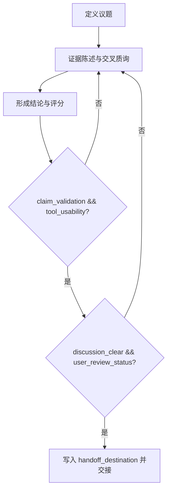
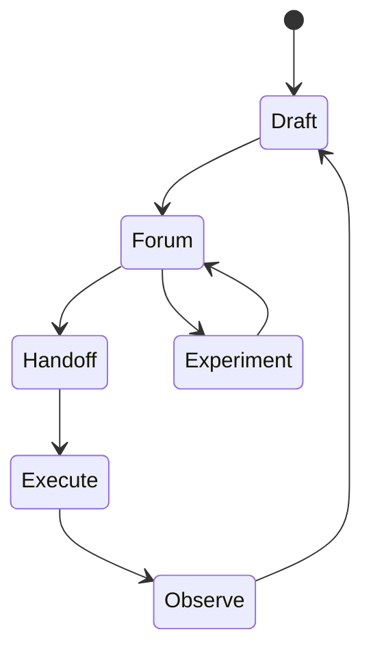

# Brainstorm 的自解释系统与专家论坛系统

这篇文章写给需要把想法整理成计划，并把计划稳定交接给下一位执行者的人。我们关心的不是会议现场有多顺畅，而是两周以后，这份结论还能不能被原样复用，还是已经在传递中失真。

## 一、讨论通常在交接处失真，而不是在讨论现场失败

### 1) 协作偏差如何发生

项目里的偏差很少来自“谁不努力”。更常见的情况是，会议里说的是同一个方向，落地时却出现两条路径：有人先改叙述，有人先改结构。下一轮同步才发现，双方优化的对象不同，返工从这里开始。

这种偏差之所以难被及时发现，是因为它在讨论阶段并不刺眼。现场看起来仍有共识，直到交接时才暴露出“边界没锁定、证据没挂钩、去向没写明”三类问题。

### 2) 三个早期信号

如果需要快速判断是否已经进入失真区，可以先看三个信号。第一，阶段命名是否频繁变化；第二，关键结论是否能定位到证据；第三，讨论结束后是否立刻出现可执行的 handoff 去向。这三个信号中，只要有两个持续偏弱，后续大概率会出现大面积重写。

### 3) 为什么要用文件契约 + QA 驱动 + 专家论坛验证

这里真正要解决的，不是“文字风格是否统一”，而是“结论能否稳定进入执行”。文件契约负责锁定输入与去向，QA 驱动负责持续澄清高影响不确定项，专家论坛（委员会）负责把分歧压到同一证据平面并完成验证收敛。三者少一个，讨论就容易停在“看起来一致”，而不是“可交接、可复盘、可执行”。

## 二、把讨论变计划，核心是接口分工和论证顺序

### 1) 四份文档分别兜住不同风险

`input_and_qa.md` 用来固定问题边界，避免定义漂移；`finding_and_analyze.md` 保存备选路径和权衡依据，避免理由丢失；`expert_forum.md` 集中争议与证据，避免关键判断散落在会话记录；`outcome_and_handoff.md` 写清去向与责任，避免“结论很好但没人承接”。

四份文档看起来只是拆分形式，实际上是在拆分风险。它们共同形成的是一个最小协作接口：上游能给出稳定输入，下游才能建立稳定执行。

### 2) 顺序如何兼顾可读与可复核

建议采用分层顺序：章节开头先给判断，帮助读者快速定位；段落内部先给证据和机制，再形成局部结论；段尾再落到动作和验收条件。  
这种写法可以避免两个极端：一类是只有观点没有证据，另一类是证据很多但读者找不到主线。

### 3) 架构图：接口依赖关系

这张图表达的是依赖关系，而不是流程装饰。上游记录不完整，下游执行就无法稳定。

## 三、专家论坛的目标是收敛争议，而不是延长会议

### 1) 论坛价值不在“讨论充分”

讨论时长增加，并不自动提高结论质量。专家论坛真正有价值的时刻，是分歧被压到同一证据平面上，然后形成可复核结论。  
如果会议结束时只有“大家都觉得差不多”，但没人能说出验收条件和回退条件，这次论坛仍未完成它的工作。

### 2) 回退逻辑要写进流程，而不是靠主持人记忆

这张图的关键是回退条件。没有回退条件，流程会一直前进，但不会真正收敛。

### 3) 主稿里应保留的内容边界

对外主稿应聚焦问题、机制、证据链和结论边界。执行字段可以提及原则，但不建议在主干段落里展开过多字段细节，否则阅读节奏会被规范信息打断。  
字段级约束更适合放到附录或执行版文档，供团队在落地时直接核对。

## 四、同源双稿策略：发布主稿 + 执行附录

### 1) 术语统一

本文统一使用“专家论坛”作为主称谓，与 `expert_forum.md` 对齐。术语统一看起来是小事，但它直接决定了跨文档检索和交接时的理解一致性。

### 2) 发布稿与执行稿如何分层

主稿负责解释“为什么这样做”。执行附录负责回答“怎么落地、谁来验收、失败时怎么回退”。  
这种分层能同时满足两类读者：外部读者获得清晰叙事，内部执行者获得可操作约束。

### 3) 指标要有口径，否则无法复盘

常见的三个指标可以保留，但必须补采样口径。  
“30 秒复述核心结论”建议由至少 5 位非作者评审在首读后独立记录，按周统计通过率；“证据可追踪率”建议以当周新增文章为样本，按关键结论抽样核对证据映射；“handoff 一次通过率”建议按任务项统计，至少连续两周观察趋势。

### 4) 循环图：发布与执行如何共用同一改进回路

这张图强调的是一件事：发布和执行不是两条平行线，而是同一条回路中的两个阶段。

### 附录 A（执行版）最低门禁字段

| 字段 | 最低要求 | 不满足时处理 |
|------|----------|--------------|
| `discussion_clear` | `true` 才能进入 handoff | 返回专家论坛继续收敛 |
| `user_review_status` | 仅允许 `approved` / `changes_requested` | 保持待办，不得归档 |
| `claim_validation` | 明确 `pass/fail` 与证据 | 标记为观点未验证 |
| `tool_usability` | 明确 `pass/fail` 与复现路径 | 标记为工具不可用 |
| `handoff_destination` | 必须可定位到文件或系统路径 | 视为未完成交接 |

### 附录 B（执行版）指标采样口径

| 指标 | 采样对象 | 最低样本量 | 统计周期 | 通过标准 |
|------|----------|------------|----------|----------|
| 30 秒复述率 | 非作者评审 | 5 人/篇 | 每周 | >= 80% 能准确复述核心结论 |
| 证据可追踪率 | 当周新增文章关键结论 | 10 条结论/周 | 每周 | >= 90% 能定位到证据 |
| handoff 一次通过率 | 进入交接的任务项 | 5 项/周 | 连续 2 周 | 趋势不下降且 >= 70% |

## 结语

写作质量的上限，最终由交接质量决定。  
当任务跨会话、跨角色推进时，谁能把判断写成可验证、可回溯、可执行的记录，谁就更可能稳定降低协作成本。
