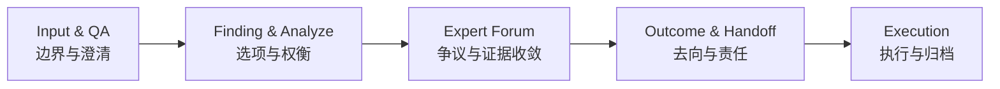
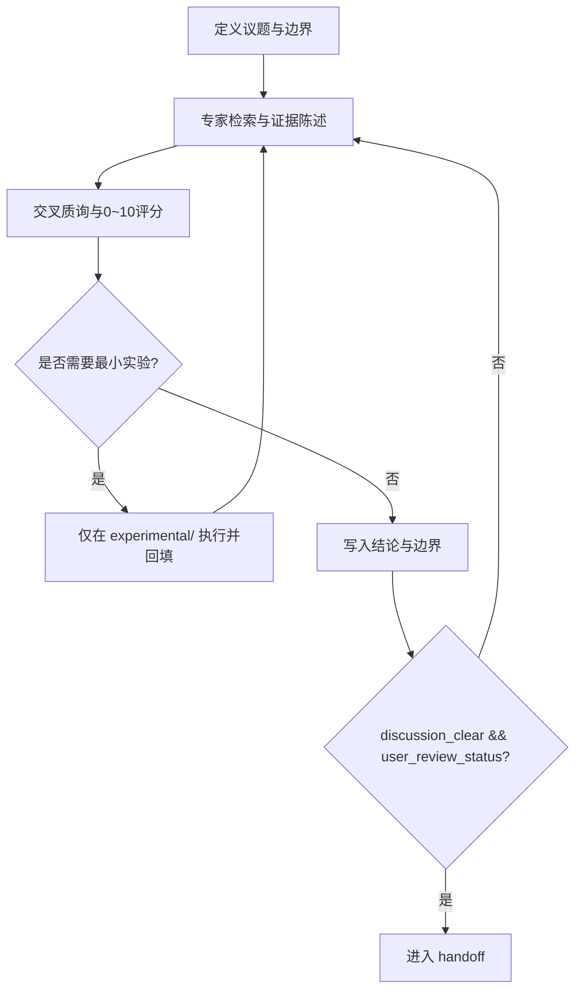
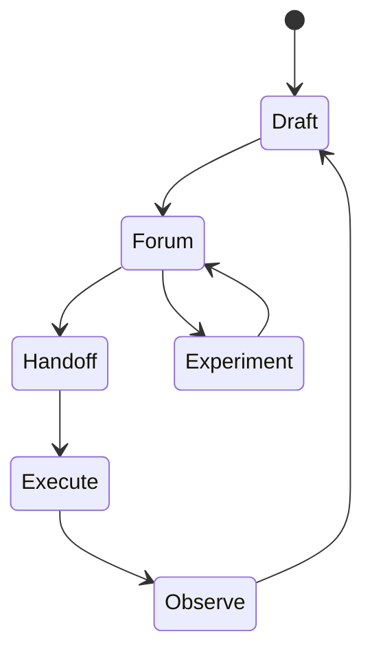

# Brainstorm 的自解释系统与专家论坛评审系统

> Coding 的尽头是项目管理

本文写给那些希望把思路理清，并最终沉淀为可执行、可回溯计划的人。无论你在写技术文章、做方案评审，还是组织一次复杂讨论，目标都一样：把“讲得通”变成“接得住、查得到、跑得动”。

## 一、为什么聪明团队也会把 Brainstorm 做成返工机器

### 1) 返工通常不是因为能力，而是因为接口

一个常见场景是：会上说“先把结构理清楚，再润色表达”，会后执行却变成“先改句子，结构以后再说”。每个人都在认真推进，但一周后不得不重来。

问题不在于谁不专业，而在于结论没有被写成可交接接口。只要“谁接、接什么、凭什么验收”不落盘，协作就会退化成口头共识。

### 2) 三个高频失效信号

最常见的失效通常有三种。第一种是结构漂移：阶段名和产物名反复变化，导致历史结论不可复用。第二种是证据漂移：先下结论、后补证据，最后没人能判断结论强度。第三种是完成态漂移：讨论结束被当成任务完成，但 handoff 去向并没有写清。

### 3) 一个反例压力测试

反例是“所有人都同意这个方向”。表面上是共识，实际上是高风险信号。  
如果没有证据映射和验收字段，这种“快速同意”会在下一次交接时转化为“快速分歧”。

## 二、把讨论变成交接，需要四个接口和一条证据链

### 1) 四个接口分别解决不同失败点

这套系统之所以拆成四个接口，是因为每个接口都在兜住一种不同的失败。`input_and_qa.md` 锁定边界，避免问题定义漂移；`finding_and_analyze.md` 呈现选项与权衡，避免决策理由丢失；`expert_forum.md` 集中争议并压实证据，避免旁路决策；`outcome_and_handoff.md` 声明去向与责任，避免伪完成态。

它们不是模板美观问题，而是分工契约问题。删掉任何一个接口，系统都会回到“靠记忆协作”。

### 2) 一条可复核的证据链

稳定写法不是“先结论还是先证据”的口号争论，而是分层顺序。在导航层先给本节判断，让读者知道方向；在论证层交代证据与机制，再形成局部结论；在执行层给出动作、边界和验收信号。

可复核链路可以固定为：`现象 -> 机制 -> 最小实验 -> 验证信号 -> 行动`。

### 3) 架构图：接口如何协同

图里表达的是依赖关系，不是时间保证。真正保证顺序的是门禁字段和验收标准。

## 三、专家论坛的价值不在“讨论充分”，而在“可审计收敛”

### 1) 论坛议程应先压证据，再收观点

`lightning_talk_forum` 和 `deep_dive_forum` 都适用同一原则：  
先证据陈述，后交叉质询；先评分，后结论。

这样可以把“谁表达更强”转为“谁的论证更可复核”。

### 2) 三项硬门禁

真正有效的硬门禁其实很朴素：关键观点必须能映射到参考、实验或状态字段；交叉评分必须给出 `0~10` 分与评分理由，且评分对象是论证而不是人；用户评判必须回填为 `approved` 或 `changes_requested`，不能留灰区。

可执行评分示例：`DecisionScore = 平均论证分 + 实验附加分 - 风险惩罚项`

### 3) 流程图：如何避免“会开完了，事还没开始”

这张图的重点是回路：没有门禁通过就返回，不允许“先往后走再补记录”。

## 四、同一份主稿如何同时服务“对外发布”和“对内落地”

### 1) 两种场景，两种投影

| 维度 | 对外发布版 | 对内执行版 |
|------|------------|------------|
| 开篇任务 | 建立问题真实感 | 声明流程边界与责任 |
| 主证据 | 场景与案例 | 门禁、评分、路径 |
| 语言重心 | 叙事可读性 | 条款可执行性 |
| 结尾形式 | 读者下一步动作 | 团队准入与降级条件 |

同一份主稿做两种投影，能避免双文档长期漂移。

### 2) 上线后先看三项信号

上线后先看三个信号：主结论可定位率（30 秒内能否复述核心判断）、证据可追踪率（关键结论能否定位到参考或实验信号）、交接一次通过率（handoff 后是否仍需补充核心上下文）。

如果第二周仍以“重写整篇”为主，说明系统还停在表达层，没有进入接口层。

### 3) 循环图：什么时候该降级，什么时候不能降级

高创意、低风险、单作者任务可以降级部分门禁。  
只要进入跨角色协作，证据映射、用户评判、handoff 去向三项不建议降级。

## 结语

技术写作的上限，不由“句子是否漂亮”决定，而由“结论能否持续被接手”决定。  
代码解决局部正确性，项目管理解决持续正确性。

当任务跨会话推进时，真正稀缺的不是灵感，而是可交接的接口质量。
