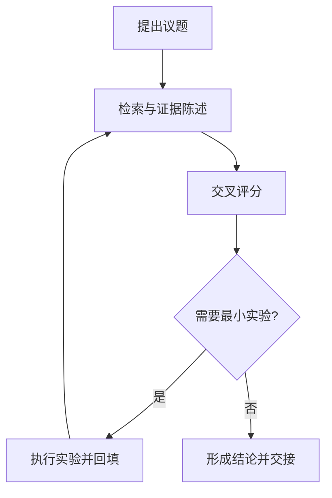
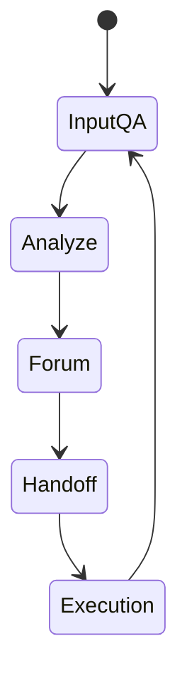

# Version v9 Techniques Handbook (Structured)

## 0) 使用方式

- 目标：把“写作建议”变成“可执行写作协议”。
- 适用：技术博客、工程方法文、流程说明文。
- 用法：先用本手册做提纲与段落设计，再用 `v8-gap-analysis.md` 做逐项审查。

## 1) 用词技巧

### 1.1 名词与专业术语

- 术语数量控制在 6~10 个核心词，超过会造成读者记忆抖动。
- 术语首次出现要给工作定义，避免“你懂我懂”的隐式约定。
- 同一概念只保留一个主词，不做同义替换炫技。

### 1.2 动词策略

- 诊断段动词：`暴露/解释/定位/约束`。
- 执行段动词：`定义/验证/回填/归档`。
- 禁止空动作词堆叠：如“优化、提升、增强”后面没有对象与验收标准。

### 1.3 连接词与过渡方法

- 段内优先因果连接：`因为 -> 所以`、`如果 -> 那么`。
- 段间优先约束连接：`在此前提下`、`换一个执行视角`、`由此进入`。
- 每个 H2 至少有一处“承接上节结论”的显式过渡句。

## 2) 句子与结构控制

### 2.1 段落与列表分工

- 列表用于并列且可单条验收的信息。
- 段落用于因果、条件、权衡、反例回应。
- 一个自然段只承载一个核心判断，后接机制或证据锚点。

### 2.2 句长与节奏

- 长句承担上下文，短句承担结论落点。
- 连续长句不超过 3 句，随后必须有一句短句收束。
- 一段中至少出现一次“判断句”，避免全段都在铺陈背景。

### 2.3 Topic Sentence Contract

- 关键段第一句必须是可争辩判断，不写“本段将讨论”类元话语。
- 判断句后 2~4 句内必须出现证据、机制或反例之一。
- 段尾句必须明确“对下一段有什么约束”。

## 3) 行文思路

### 3.1 文章结构（多级标题拆分）

- `H1` 1 个；`H2` 3~5 个；`H3` 每个 `H2` 下 2~4 个。
- `H2` 负责回答主问题，`H3` 负责展开“判断 -> 机制 -> 信号”。
- 标题优先使用读者问题句或动作句，避免抽象类目词。

### 3.2 开门见山与逐步升级

- 开篇先给读者契约：这篇写给谁，读完能做什么。
- 中段用“失败样本 -> 机制解释 -> 修复动作”制造叙事张力。
- 结尾必须给上线顺序、降级边界、验收信号。

### 3.3 例子的使用

- 每个核心模块至少一个最小例子，优先 `before/after`。
- 例子必须映射验收条件，不写只负责“有画面感”的例子。
- 例子尽量贴近当前项目上下文，降低抽象迁移成本。

## 4) 论证一致性与证据体系

### 4.1 双层论证顺序（重点）

- 导航层：章节开头可先给判断，帮助读者定位方向。
- 论证层：段落内部遵循“证据或机制 -> 局部结论”。
- 收束层：把结论转成可执行动作与边界条件。

### 4.2 证据梯度

- 标准梯度：`现象 -> 机制 -> 最小实验 -> 验证信号 -> 行动`。
- 任一环节缺失都要补偿：
  - 缺实验：必须给可复核外部证据。
  - 缺信号：必须给可追踪字段或验收标准。

### 4.3 反例压力测试

- 每个关键判断至少给一个失败路径或反例触发条件。
- 反例后必须写“为何失败 + 如何修复 + 修复后如何验收”。
- 没有反例的“完美论证”视为高风险段落。

## 5) 可执行性、信息架构与发布适配

### 5.1 可执行性协议

- 每个“建议”都要落到动作对象、执行人、验收条件。
- 门禁字段建议标准化：`status`、`discussion_clear`、`user_review_status`。
- 关键路径必须可追踪到文件或目录，而不是只写原则。

### 5.2 信息架构与扫描效率

- 每个 H2 第一屏要出现本节判断句，不让读者滚动后才知道重点。
- 表格只用于对照关系，流程关系优先用流程图。
- 一页内并列列表项建议 3~7 项，超过后应再分层。

### 5.3 发布适配（对外 vs 对内）

- 对外稿：优先问题真实感、案例、转折与读者收益。
- 对内稿：优先门禁条款、评分规则、路径与责任。
- 复用策略：一份主稿 + 两个投影视图，避免双份文档长期漂移。

## 6) 图示技巧（架构图、流程图、循环图）

### 6.1 何时必须画图

- 有角色或模块关系：画架构图（谁与谁交互）。
- 有步骤顺序与分支：画流程图（怎么走、哪里回退）。
- 有持续迭代闭环：画循环图或状态图（如何反复运行）。

### 6.2 图示与正文的分工

- 图回答“结构关系是什么”，正文回答“为什么这样设计”。
- 图后必须跟一段解释“如何阅读这张图”。
- 不在图里塞满解释性句子，避免图文都重、信息重复。

### 6.3 Mermaid 最小模板

## 7) 快速质检清单（发布前）

- [ ] 读者契约是否在开篇明确
- [ ] 关键判断是否有证据锚点
- [ ] 是否修复“导航层先判断/论证层先证据”冲突
- [ ] 是否至少有一处反例压力测试
- [ ] 每个 H2 是否可独立回答一个主问题
- [ ] 是否有至少一张图表达结构/流程/闭环之一
- [ ] 是否给出上线后可观察信号

## 8) 高频反模式

- 抽象词过多，动作对象缺失。
- 章节标题很好看，但无法独立传达任务。
- 只有正向论证，没有反例压力。
- 评分和门禁存在，但与正文结论脱节。
- 图只是装饰，与正文判断没有绑定关系。
