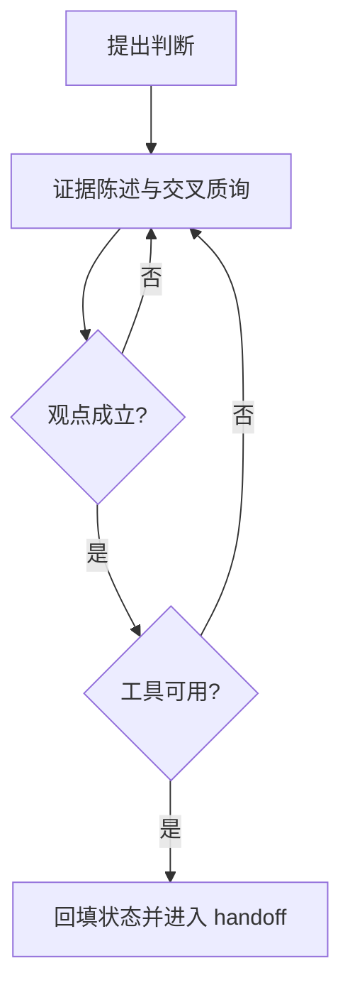

# Brainstorm 的自解释系统与专家论坛机制

> Coding 的尽头是项目管理

这篇文章讨论的不是“怎么把会议纪要写得更漂亮”，而是一个更现实的问题：一轮讨论结束后，结论能不能被下一位执行者准确接住。  
在复杂项目里，讨论失效往往不发生在会议室，而发生在交接时刻。我们看到的返工、重启和分歧，很多都来自同一个根因：讨论没有被写成可执行接口。

## 一、Brainstorm 的目标不是产出观点，而是产出可交接计划

如果把 brainstorm 理解成“灵感收集”，它的上限就是一次对话的热度；如果把它设计成“决策基础设施”，它的上限才会变成组织复用能力。  
这也是为什么同样是认真讨论，有的团队会持续重来，有的团队却能稳定推进。

从执行角度看，判断一次 brainstorm 是否成功，不看会中讨论强度，而看会后三件事是否成立：边界是否被锁定，证据是否可追踪，交接去向是否明确。只要其中一项缺失，团队很快会回到“每轮都像第一次讨论”的状态。

## 二、要让讨论稳定落地，需要三个机制同时工作

### 1) 文件契约：让每个阶段有明确职责

`input_and_qa.md` 负责锁定边界和关键澄清，`finding_and_analyze.md` 负责保留选项和权衡依据，`expert_forum.md` 负责收敛争议与证据，`outcome_and_handoff.md` 负责写清去向和责任。  
这四份文件不是模板偏好，而是协作接口。它们把“讨论内容”转成“下一步可执行输入”。

### 2) QA 驱动：把高影响不确定项前置处理

很多返工不是因为判断错，而是因为关键问题在讨论初期被跳过。QA 驱动的作用，就是在方向确定前先处理高影响不确定项，并把结论回填到文档。  
这一步做得越扎实，后续论坛越容易聚焦在真正有争议的部分，而不是重复补上下文。

### 3) 专家论坛验证：让分歧在证据平面收敛

专家论坛的价值不是“观点多”，而是“证据可比”。先证据陈述，再交叉质询，再形成评分与结论，最后通过用户评判确认。  
如果缺少这条验证链，论坛很容易变成高质量聊天，难以形成可复盘结论。

这张图强调的是依赖关系：上游不稳，下游就算写得再完整，也很难稳定执行。

## 三、验证环节的关键，不是“做实验”，而是“做可复核实验”

一轮可用的验证至少回答两个问题：观点是否成立，工具是否可用。  
观点成立保证方向不空转，工具可用保证流程能复现。只验证其中一个，都会导致“逻辑正确但落不了地”或“能跑流程但方向偏差”。

实验隔离同样重要。所有试验改动都应限定在 `experimental/` 目录，源文保持不可写。这样用户看到的是“实验结果”，不是“被静默覆盖后的现状”。  
这条边界在多轮迭代里尤其关键，因为它直接决定审计的可信度。

## 四、发布稿与执行稿应同源，但不要混写

对外发布稿和对内执行稿可以共用同一主稿，但职责不同。发布稿回答“为什么这样设计”，执行稿回答“怎么验收、怎么回退、谁来负责”。  
把两者直接混在主干段落，常见后果是：叙事被规范信息打断，规范又缺少执行上下文。

更稳妥的做法是保留同源结构，再把字段级门禁和采样口径放到执行附录。这样既能保证可读性，也不牺牲执行确定性。

### 附录（执行版）最小门禁字段

| 字段 | 最低要求 | 不满足时处理 |
|------|----------|--------------|
| `discussion_clear` | `true` 才能进入 handoff | 返回专家论坛继续收敛 |
| `user_review_status` | `approved/changes_requested` | 保持待办 |
| `claim_validation` | `pass/fail` + 证据 | 标记观点未验证 |
| `tool_usability` | `pass/fail` + 复现路径 | 标记工具不可用 |
| `handoff_destination` | 可定位路径 | 视为未交接 |

### 附录（执行版）指标采样口径

| 指标 | 采样对象 | 最低样本量 | 统计周期 | 通过标准 |
|------|----------|------------|----------|----------|
| 30 秒复述率 | 非作者评审 | 5 人/篇 | 每周 | >= 80% |
| 证据可追踪率 | 当周关键结论 | 10 条/周 | 每周 | >= 90% |
| handoff 一次通过率 | 进入交接的任务项 | 5 项/周 | 连续 2 周 | >= 70% 且趋势不下降 |

## 结语

Brainstorm 的终点不是“讨论清楚了”，而是“下一位执行者可以直接开始”。  
当任务跨会话、跨角色推进时，真正决定产出稳定性的，不是表达强度，而是接口质量。
